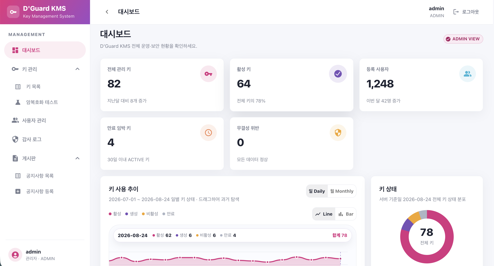
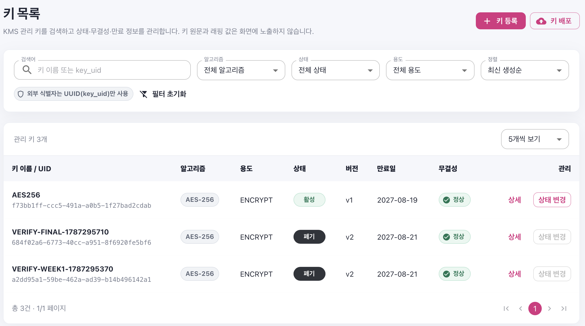
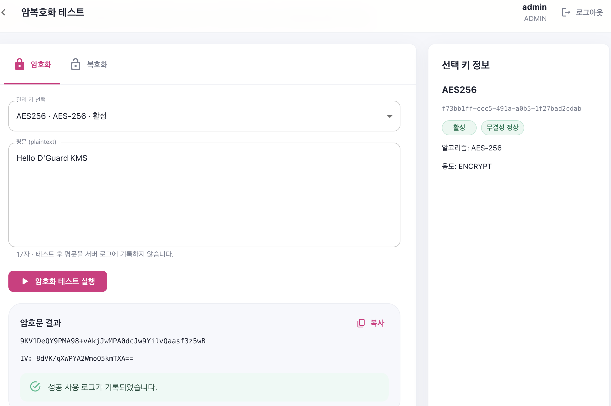
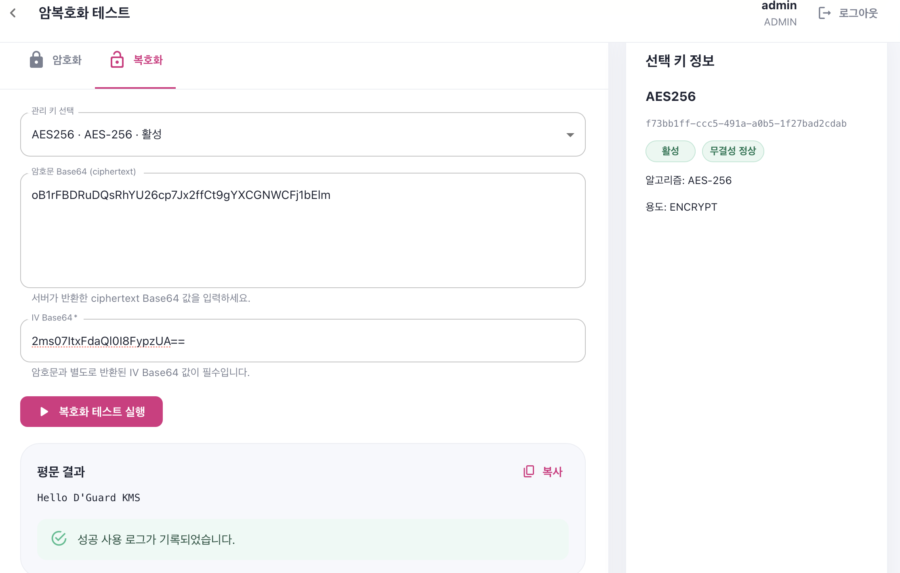

# my-project

> D'Guard KMS 관리자 웹 — 1st Week

## 프로젝트 소개 (Overview)

`my-project`는 아이넵 통합키관리 시스템 **D'Guard KMS**의 관리자 웹 프로젝트입니다. 관리자는 웹 콘솔에서 로그인한 뒤 키 현황을 확인하고, 키를 등록·조회하거나 암복호화 동작을 시험할 수 있습니다. 사용자·공지사항·감사 로그 관리 화면도 동일한 관리 콘솔 안에서 제공합니다.
다
1주차 구현은 레이아웃 / API / 암복호화 초기 구현에 초점을 맞췄습니다. 백엔드는 관리자 비밀번호를 평문이 아닌 PBKDF2 해시와 개별 Salt로 저장하고 JWT 인증을 수행합니다. 또한 마스터 프레이즈로 키를 유도한 뒤 KCV(Key Check Value)를 검증하여, 잘못된 패스프레이즈로는 애플리케이션이 기동되지 않도록 보호합니다.

### 핵심 기능

- `admin/admin` 초기 관리자 로그인 및 JWT 기반 인증
- 각종 레이아웃(AppBar, Drawer, 콘텐츠 영역)
- PBKDF2-HMAC-SHA256 기반 비밀번호 해시 및 Salt 저장
- PBKDF2 기반 마스터키 유도와 KCV 기동 검증
- AES-256-GCM 기반 데이터 암호화 및 HMAC-SHA256 무결성 검증
- 키 관리, 사용자 관리, 감사 로그, 공지사항, 대시보드 화면/API 구조

## 주요 화면 (Screenshots)

> 화면에 표시된 수치, 키 이름 및 UUID는 기능 시연을 위한 예시 데이터입니다.

### 대시보드

전체·활성·만료 임박 키, 등록 사용자 및 무결성 위반 현황을 요약 카드로 제공합니다. 일별/월별 키 사용 추이와 키 상태 분포를 함께 확인할 수 있습니다.



### 키 목록

키 이름 또는 UUID를 검색하고 알고리즘·상태·용도별로 필터링할 수 있습니다. 키 원문과 래핑 값은 목록에 노출하지 않으며 상태, 버전, 만료일, 무결성 결과만 제공합니다.



### 암복호화 테스트

선택한 `ACTIVE` 키로 평문을 암호화하거나, 서버가 반환한 Base64 암호문과 IV를 입력해 복호화할 수 있습니다. 테스트 결과와 성공 여부는 키 사용 로그에 기록됩니다.

| 암호화 | 복호화 |
|---|---|
| 평문을 AES-256-GCM으로 암호화하고 암호문과 임의 IV를 반환합니다. | 암호문과 IV를 검증한 뒤 원래 평문을 복원합니다. |
| [](readme-assets/crypto-encrypt.png) | [](readme-assets/crypto-decrypt.png) |

## 기술 스택 (Tech Stack)

### Backend

| 구분 | 기술 | 버전/용도 |
|---|---|---|
| Language | Java | 21 |
| Framework | Spring Boot | 4.1.0 |
| Security | Spring Security, JWT | JWT 인증, JWT 0.12.6 |
| Persistence | Spring Data JPA, Flyway | ORM 및 DB 마이그레이션 |
| API Docs | SpringDoc OpenAPI | 3.0.3 |
| Build/Test | Gradle Wrapper, JUnit | Gradle 9.5.1 |
| Database | PostgreSQL / H2 | 운영 17, 로컬 프로필 H2 |

### Frontend

| 구분 | 기술 | 버전/용도 |
|---|---|---|
| Language | TypeScript | 6.0 |
| UI | React | 19.2 |
| Component Library | MUI (Material UI) | 9.3 |
| Routing | React Router DOM | 7.18 |
| HTTP Client | Axios | 1.19 |
| Build Tool | Vite | 8.2 |
| Lint | Esint | 1.75 |

### Infrastructure & Security

| 구분 | 기술 |
|---|---|
| Container | Docker, Docker Compose |
| Web Server | Nginx 1.27 |
| CI/CD | GitHub Actions, Docker Hub |
| Key Derivation | PBKDF2-HMAC-SHA256, 210,000회 |
| Encryption | AES-256-GCM |
| Integrity | HMAC-SHA256 |
| Encoding | Base64 |

## 1주차 구현 목표 및 현황 (Week 1 Progress)

### 목표 대비 구현 결과

- [x] MUI 기반 로그인 화면 및 로그인 실패 `Alert` 구현
- [x] `POST /api/auth/login` 로그인 API와 JWT 발급 구현
- [x] `GET /api/auth/me`, `POST /api/auth/logout` 구현
- [x] JWT 인증 필터, Stateless Spring Security 필터 체인 구성
- [x] Axios 요청의 Bearer 토큰 자동 주입 및 401 자동 로그아웃 구현
- [x] 인증 여부·역할에 따른 보호 라우팅 구현
- [x] 반응형 AppBar, Drawer, 콘텐츠 레이아웃 구현
- [x] 대시보드·키·사용자·감사 로그·공지사항 화면 및 라우팅 골격 구현
- [x] `admin/admin` 초기 계정을 PBKDF2 해시와 개별 Salt로 생성
- [x] 마스터 패스프레이즈 기반 키 유도 및 KCV 검증 구현
- [x] 패스프레이즈 불일치 시 애플리케이션 기동 중단 구현
- [x] 인증, 해시 저장, KCV 실패, 암호문 변조 방지 통합 테스트 작성

> 이 문서의 주차별 진행 섹션에는 추후 `Week 2`, `Week 3` 등을 순차적으로 추가 예정입니다.

### 주요 파일·모듈 역할

| 영역 | 파일/모듈 | 역할 |
|---|---|---|
| Backend | `config/DataInitializer.java` | 초기 `admin/admin`, `client/client` 계정을 해시 형태로 생성 |
| Backend | `config/SecurityConfig.java` | Stateless 보안 정책, CORS, 인증/인가 예외 응답 구성 |
| Backend | `security/JwtTokenProvider.java` | JWT 생성·파싱·검증 |
| Backend | `security/JwtAuthenticationFilter.java` | 요청의 Bearer 토큰을 검증하고 인증 컨텍스트 구성 |
| Backend | `security/PasswordService.java` | 비밀번호 PBKDF2 해시·Salt 생성 및 상수 시간 비교 |
| Backend | `crypto/MasterKeyService.java` | 패스프레이즈로 마스터키 유도, KCV 저장·검증, 키 메모리 정리 |
| Backend | `crypto/CryptoUtil.java` | AES-256-GCM 암복호화 |
| Backend | `crypto/IntegrityService.java` | HMAC-SHA256 기반 데이터 무결성 검증 |
| Backend | `domain/auth/` | 로그인·내 정보·로그아웃 API와 관리자 엔티티 |
| Backend | `common/` | 공통 API/페이징 응답 및 전역 예외 처리 |
| Backend | `db/migration/` | Flyway 기반 스키마 버전 관리 |
| Frontend | `pages/Login.tsx` | 로그인 입력, 오류 메시지, 인증 성공 이동 |
| Frontend | `layouts/MainLayout.tsx` | 상단 바, 반응형 사이드바, 역할별 메뉴와 콘텐츠 영역 |
| Frontend | `components/auth/RouteGuards.tsx` | 로그인 여부 및 역할 기반 라우트 접근 제어 |
| Frontend | `contexts/AuthProvider.tsx` | 로그인 세션, 토큰, 사용자 상태 관리 |
| Frontend | `api/client.ts` | Axios 공통 설정, JWT 주입, 401 세션 정리 |
| Frontend | `App.tsx` | 전체 페이지 라우팅과 Lazy Loading 구성 |
| Frontend | `pages/` | 대시보드, 키, 사용자, 감사 로그, 공지사항 화면 |

## 프로젝트 구조 (Directory Structure)

```text
my-project/
├── .github/
│   └── workflows/deploy.yml          # 이미지 빌드·배포 CI/CD
├── .codex-context.md                 # 개발 목표와 프로젝트 컨텍스트
├── .env.example                      # 배포 환경변수 템플릿
├── docker-compose.yml                # PostgreSQL·Backend·Frontend 구성
├── README.md
├── readme-assets/                    # README 화면 스크린샷
├── backend/
│   ├── build.gradle
│   ├── gradlew
│   ├── gradle/wrapper/
│   ├── Dockerfile
│   └── src/
│       ├── main/
│       │   ├── java/com/ineb/dguard_kms/
│       │   │   ├── DguardKmsApplication.java
│       │   │   ├── common/           # 공통 응답·예외 처리
│       │   │   ├── config/           # Security·Crypto·초기 데이터 설정
│       │   │   ├── crypto/           # 마스터키·암호화·무결성
│       │   │   ├── security/         # JWT·비밀번호·인증 필터
│       │   │   └── domain/
│       │   │       ├── auth/         # 관리자 인증
│       │   │       ├── config/       # 암호 설정 영속화
│       │   │       ├── key/          # KMS 키 생명주기
│       │   │       ├── user/         # 서비스 사용자
│       │   │       ├── audit/        # 감사 로그·해시 체인
│       │   │       ├── notice/       # 공지사항·첨부파일
│       │   │       └── dashboard/    # 요약 통계
│       │   └── resources/
│       │       ├── application.properties
│       │       ├── application-local.properties
│       │       └── db/migration/     # Flyway SQL
│       └── test/                     # 통합·KCV·키 관리 테스트
└── frontend/
    ├── package.json
    ├── vite.config.ts
    ├── Dockerfile
    ├── nginx.conf
    ├── public/
    └── src/
        ├── api/                       # Axios 및 API 엔드포인트
        ├── components/                # 공통·인증·관리자 컴포넌트
        ├── contexts/                  # 인증·KMS 상태 Provider
        ├── hooks/                     # 인증·KMS 훅
        ├── layouts/MainLayout.tsx
        ├── mocks/                     # 화면 개발용 데이터
        ├── pages/                     # 라우트별 화면
        ├── theme/                     # MUI 테마
        ├── types/                     # TypeScript 타입
        ├── utils/                     # 상태·키 생명주기 유틸리티
        ├── App.tsx
        └── main.tsx
```

## 시작하기 (Getting Started)

### 사전 요구사항

- JDK 21
- Node.js 22 및 npm
- Docker 29+ (PostgreSQL을 컨테이너로 실행할 경우)

저장소를 받은 뒤 프론트엔드 의존성을 설치합니다. 백엔드는 Gradle Wrapper가 필요한 의존성을 자동으로 내려받습니다.

```bash
git clone https://github.com/devlsj/AdminWeb.git my-project
cd my-project

cd frontend
npm ci
cd ..
```

### 1. PostgreSQL 실행

로컬 개발용 PostgreSQL 17 컨테이너를 실행합니다. `dguard-postgres-data` 볼륨에 데이터가 유지됩니다.

```bash
docker run --name dguard-postgres \
  -e POSTGRES_DB=dguard_kms \
  -e POSTGRES_USER=dguard \
  -e POSTGRES_PASSWORD=dguard-local-password \
  -p 127.0.0.1:5432:5432 \
  -v dguard-postgres-data:/var/lib/postgresql/data \
  -d postgres:17-alpine
```

이미 생성한 컨테이너는 다음 명령으로 다시 실행할 수 있습니다.

```bash
docker start dguard-postgres
```

### 2. 환경 설정

필수 비밀값은 저장소에 커밋하지 말고 로컬 개발에서는 셸 환경변수로 관리합니다. 루트 `.env` 파일은 Docker Compose 배포에서만 사용합니다.

| 환경변수 | 설명 | 예시/기본값 |
|---|---|---|
| `SPRING_DATASOURCE_URL` | PostgreSQL JDBC URL | `jdbc:postgresql://localhost:5432/dguard_kms` |
| `SPRING_DATASOURCE_USERNAME` | DB 사용자 | `dguard` |
| `SPRING_DATASOURCE_PASSWORD` | DB 비밀번호 | 필수 |
| `SPRING_JPA_HIBERNATE_DDL_AUTO` | DDL 정책 | 개발 `create`, 운영 `validate` |
| `KMS_MASTER_PASSPHRASE` | 마스터키 유도 패스프레이즈 | 필수, 20자 이상 |
| `INTEGRITY_HMAC_KEY` | 무결성 HMAC 키 | 필수 |
| `JWT_SECRET` | JWT 서명 키 | 필수 |
| `KMS_PBKDF2_ITERATIONS` | 마스터키 PBKDF2 반복 횟수 | `210000` |
| `PASSWORD_PBKDF2_ITERATIONS` | 비밀번호 PBKDF2 반복 횟수 | `210000` |

```bash
export SPRING_DATASOURCE_URL=jdbc:postgresql://localhost:5432/dguard_kms
export SPRING_DATASOURCE_USERNAME=dguard
export SPRING_DATASOURCE_PASSWORD=dguard-local-password
export SPRING_JPA_HIBERNATE_DDL_AUTO=update
export KMS_MASTER_PASSPHRASE=local-master-passphrase-at-least-20-chars
export INTEGRITY_HMAC_KEY=local-integrity-hmac-key-at-least-32-chars
export JWT_SECRET=local-jwt-secret-at-least-32-characters
```

최초 기동 시 `crypto_config`에 마스터키 유도 Salt와 KCV가 기록됩니다. **같은 DB를 사용할 때는 이후에도 동일한 `KMS_MASTER_PASSPHRASE`를 사용해야 합니다.**

### 3. Backend 실행

```bash
cd backend
./gradlew bootRun
```

### 4. Frontend 실행

새 터미널에서 API 주소를 지정해 Vite 개발 서버를 실행합니다.

```bash
cd frontend
VITE_API_BASE_URL=http://localhost:8080 npm run dev
```

터미널에 출력된 Vite 주소(기본값 <http://localhost:5173>)로 접속한 뒤 아래 초기 계정으로 로그인합니다.

```text
ID: admin
Password: admin
```

### Docker Compose 배포

루트 `docker-compose.yml`은 Docker Hub에 빌드된 이미지와 서버의 `/home/dguard/app/` 마운트 경로를 사용하는 **배포 환경용 구성**입니다.

```bash
cp .env.example .env
# .env의 이미지 계정과 모든 비밀값을 실제 값으로 변경
docker compose pull
docker compose up -d
docker compose ps
```

배포 환경에서는 프론트엔드 Nginx가 `/api/*` 요청을 백엔드로 프록시하며, 외부 서비스 포트는 `80`입니다.


### 명령어

#### 1) 로그인 API 확인

```bash
curl -i -X POST http://localhost:8080/api/auth/login \
  -H 'Content-Type: application/json' \
  -d '{"loginId":"admin","password":"admin"}'
```

정상 응답의 `data.token`에 JWT가 포함됩니다.

#### 2) 비밀번호 저장 형태 확인

```bash
docker exec -it dguard-postgres psql -U dguard -d dguard_kms -c \
  'SELECT login_id, password_hash, password_salt, password_algo, password_iter FROM admin_user;'
```

`password` 원문 컬럼은 존재하지 않으며 `password_hash`, `password_salt`, 알고리즘과 반복 횟수만 저장됩니다.

#### 3) KCV 실패 확인

정상 패스프레이즈로 한 번 기동해 KCV를 생성한 뒤 서버를 종료하고, 같은 DB에서 다른 패스프레이즈로 다시 실행합니다.

```bash
cd backend
KMS_MASTER_PASSPHRASE=wrong-master-passphrase-at-least-20-chars ./gradlew bootRun
```

로그에 `Master key KCV verification failed`가 출력되고 Spring Boot 기동이 중단되어야 합니다. 시연 후에는 원래 패스프레이즈로 복구합니다.

## 테스트 및 품질 검사

```bash
# Backend 테스트
cd backend
./gradlew test

# Frontend 정적 검사 및 프로덕션 빌드
cd ../frontend
npm run lint
npm run build
```

주요 테스트는 초기 계정의 Salt 적용 여부, 로그인/JWT 인증, 잘못된 로그인 거절, KCV 불일치 기동 실패, AES-GCM 임의 IV 및 변조 거절을 검증합니다.

## 보안 주의사항

- `.env`, DB 비밀번호, JWT 키, 마스터 패스프레이즈를 Git에 커밋하지 않습니다.
- 예시 초기 계정은 개발·발표용입니다.
- 운영 환경에서는 `SPRING_JPA_HIBERNATE_DDL_AUTO=validate`를 사용합니다.
- 암호화된 데이터와 `crypto_config`가 있는 DB를 백업할 때 마스터 패스프레이즈도 별도의 안전한 경로로 관리합니다.
- 마스터 패스프레이즈 변경은 단순 환경변수 교체가 아니라 키 재래핑 절차가 필요합니다.
