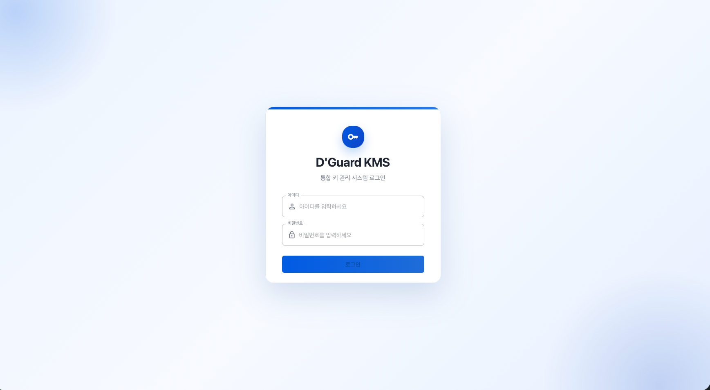
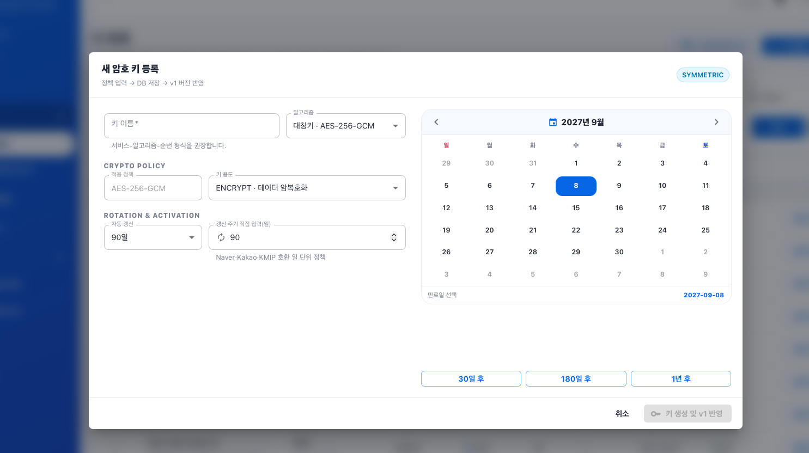
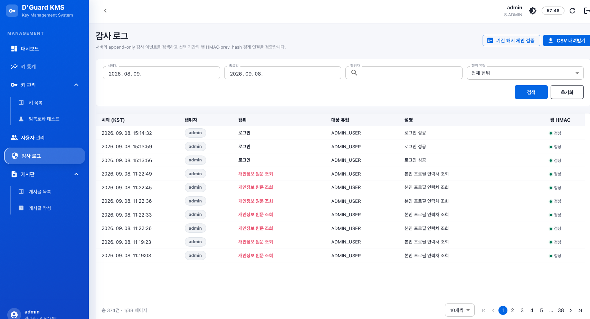
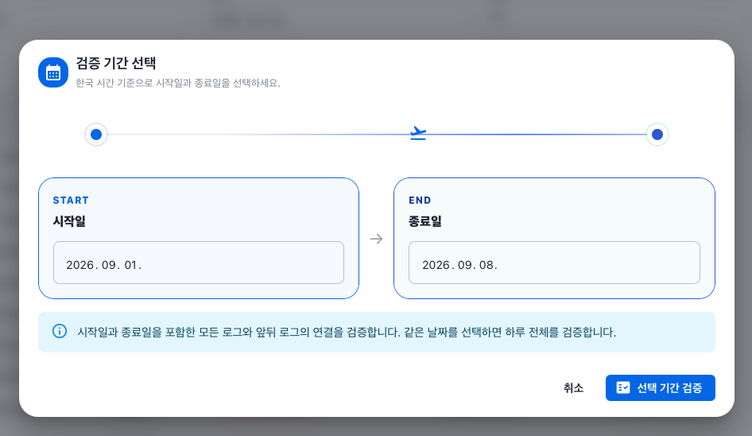
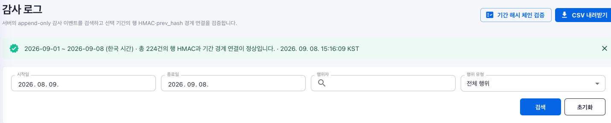
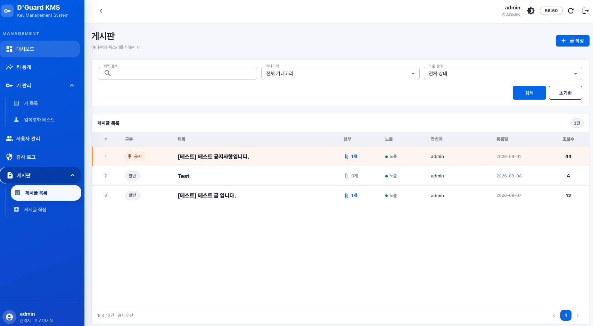
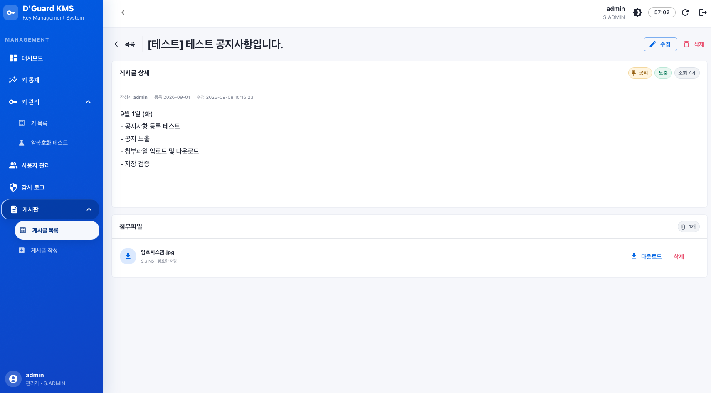
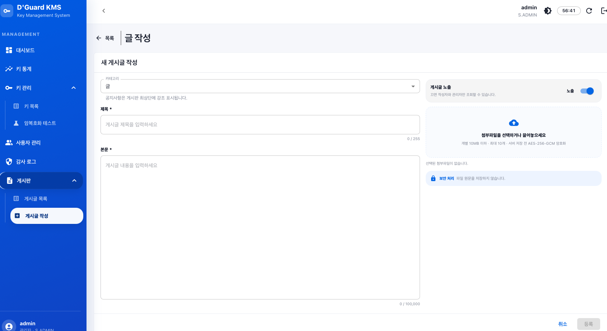

# D'Guard KMS

> 암호키의 생성부터 갱신·폐기까지, 사용자 정보와 감사 이력을 함께 관리하는 통합 키 관리 웹 콘솔

<p align="center">
  
  
  
  
  
  
</p>

---

## 프로젝트 소개

**D'Guard KMS**는 암호키와 개인정보를 관리하고, 주요 작업의 감사 로그 및 무결성을 확인하는 웹 애플리케이션입니다. React 기반 관리 화면과 Spring Boot API를 연결해 키 정책, 사용자 계정, 게시글과 암호화 첨부파일을 관리합니다.

대시보드에서는 키 현황·사용 추이·최근 활동을 확인하고 각 관리 화면으로 이동할 수 있습니다. 감사 로그는 행 HMAC과 해시 체인 검증으로 위·변조 여부를 확인하며, 개인정보 원문 조회는 별도 감사 이력으로 남깁니다.

---

## 주요 기능

| 기능 | 설명 |
| --- | --- |
| 로그인·세션 | JWT 인증, 역할별 화면 접근 제어, 남은 세션 시간 표시 및 세션 연장 |
| 대시보드 | 전체 키·암호화 가능·만료 임박·무결성 위반 요약, 사용 추이, 최근 활동, 게시글 |
| 키 통계 | 최근 30일·12개월 사용량, 키 상태 및 알고리즘 분포, 카드 내부 스크롤 |
| 키 관리 | 키 검색·등록·상태 변경·갱신·배포·폐기, 버전·만료일·무결성 조회 |
| 암·복호화 테스트 | 키 정책과 상태에 따른 암·복호화 실행, 결과 및 사용 이력 확인 |
| 사용자 관리 | 이름·이메일 부분 검색, 연락처 정확 검색, 개인정보 마스킹·암호화 및 권한별 관리 |
| 프로필 관리 | 본인 표시 이름·이메일·전화번호 조회 및 수정, 연락처 암호화 저장 |
| 감사 로그 | 기간·행위자·행위별 검색, 행 HMAC 및 기간 해시 체인 검증, 위반 조회, CSV 내보내기 |
| 게시판 | 공지 우선 표시, 게시글 작성·수정·삭제·노출 설정, 본문 입력 영역 내부 스크롤 |
| 첨부파일 | 클릭·드래그 앤 드롭 첨부, 개별 10MB·최대 10개 검증, 암호화 저장 및 다운로드 |

---

## 기술 스택

| 구분 | 기술 |
| --- | --- |
| Backend | Java 21, Spring Boot 4.1, Spring Security, Spring Data JPA |
| Frontend | React 19, TypeScript 6, MUI 9, React Router 7, Axios |
| Database | PostgreSQL 17, Flyway |
| Authentication | JWT, PBKDF2-HMAC-SHA256 비밀번호 해시 및 개별 Salt |
| Cryptography | AES-256-GCM, RSA, HMAC-SHA256, 마스터키 KCV 검증 |
| Build / Test | Gradle Wrapper, JUnit, Vite 8, Oxlint |
| API Documentation | SpringDoc OpenAPI, Swagger UI |
| Deployment | Docker Compose, Nginx, GitHub Actions |

---

## 화면 미리보기

2026년 9월 UI 기준입니다. 이미지를 클릭하면 원본 크기로 확인할 수 있습니다.

### 1. 로그인

아이디·비밀번호로 로그인하고, 인증된 세션과 역할에 따라 관리 화면에 접근합니다.

[](readme-assets/login.png)

### 2. 대시보드

네 개의 요약 카드와 키 사용 추이·상태 분포를 한 화면에 표시합니다. 최근 활동과 게시글은 카드 내부에서 스크롤하며, 전체보기 버튼으로 상세 목록에 이동합니다.

[](readme-assets/dashboard.png)

### 3. 키 목록

검색 조건과 목록 열을 정렬해 키 이름·알고리즘·상태·버전·만료일·무결성을 비교합니다. 키 등록 창에서는 알고리즘, 용도, 자동 갱신 주기와 만료일을 설정합니다.

| 키 목록 | 키 등록 |
| --- | --- |
| [](readme-assets/key-list.png) | [](readme-assets/key-register.png) |

### 4. 감사 로그

행위별 감사 이력을 조회하고 개인정보 원문 조회를 붉은 글씨로 구분합니다. 검증 기간을 선택하면 한국 시간 기준 해당 기간의 행 HMAC과 해시 체인 경계 연결을 검증합니다.

[](readme-assets/audit-log.png)

| 검증 기간 선택 | 기간 검증 결과 |
| --- | --- |
| [](readme-assets/audit-period.png) | [](readme-assets/audit-result.png) |

### 5. 게시판

**여러분의 목소리를 담습니다.** 공지는 목록 상단에서 주황색으로 강조하며, 게시글 상세와 첨부파일을 분리해 표시합니다.

[](readme-assets/board-list.png)

| 게시글 상세 | 글 작성 |
| --- | --- |
| [](readme-assets/board-detail.png) | [](readme-assets/board-create.png) |

---

## 프로젝트 구조

```text
AdminWeb/
├─ frontend/
│  ├─ src/
│  │  ├─ api/                  # API 클라이언트와 엔드포인트
│  │  ├─ components/           # 공통 표·검색·차트·인증 컴포넌트
│  │  ├─ contexts/             # 인증·키 관리 상태
│  │  ├─ layouts/              # 상단 바·사이드바·페이지 영역
│  │  └─ pages/                # 대시보드·통계·키·사용자·감사·게시판·프로필
│  ├─ package.json
│  └─ Dockerfile
├─ backend/
│  ├─ src/main/java/com/ineb/dguard_kms/
│  │  ├─ common/               # 공통 응답·예외 처리
│  │  ├─ config/               # 보안·프로비저닝 설정
│  │  ├─ crypto/               # 암호화·마스터키·무결성
│  │  ├─ security/             # JWT·비밀번호 처리
│  │  └─ domain/               # auth·key·user·audit·notice·config
│  ├─ src/main/resources/db/migration/
│  ├─ src/test/                # API·암호화·무결성 통합 테스트
│  └─ build.gradle
├─ readme-assets/              # 탭별 화면 이미지
├─ docs/LOCAL_DEVELOPMENT.md    # 실행·운영·검증 상세 안내
├─ .github/workflows/          # 이미지 빌드·배포
├─ docker-compose.yml
└─ README.md
```

---

## 실행 방법

### 1. 저장소 준비

JDK 21, Node.js 22 및 PostgreSQL 17을 준비합니다.

```bash
git clone https://github.com/DevLSJ/AdminWeb.git
cd AdminWeb
npm ci --prefix frontend
```

### 2. 환경 설정 및 계정 생성

DB 연결 정보, `KMS_MASTER_PASSPHRASE`, `INTEGRITY_HMAC_KEY`, `JWT_SECRET`을 환경변수로 설정합니다. 최초 계정은 명시적 일회성 프로비저닝으로 생성하며 기본 로그인 비밀번호를 제공하지 않습니다.

DB 기동, 환경변수 설정, 최초 계정 생성과 Docker Compose 배포는 [실행·운영 안내](docs/LOCAL_DEVELOPMENT.md)를 참고하세요.

### 3. 백엔드·프런트엔드 실행

```bash
# 터미널 1 — 환경 설정과 최초 계정 생성 후 실행
cd backend
./gradlew bootRun
```

```bash
# 터미널 2 — 저장소 루트에서 실행
VITE_API_BASE_URL=http://localhost:8080 npm run dev --prefix frontend
```

| 서비스 | 기본 주소 |
| --- | --- |
| 웹 콘솔 | `http://localhost:5173` |
| Backend API | `http://localhost:8080/api` |
| Swagger UI | `http://localhost:8080/api/swagger-ui.html` |

---

## 구현 포인트

### 1. 키 생명주기와 암호화

키의 상태·용도에 따라 작업을 제한하며 등록, 상태 변경, 갱신, 폐기 이력을 관리합니다. 키 갱신은 확인 창과 경고를 거쳐 진행하고, 갱신 전 버전의 암호문 복호화를 차단합니다. 마스터 패스프레이즈 불일치는 KCV 검증 단계에서 기동을 중단합니다.

### 2. 감사 로그 위·변조 검증

개별 행의 HMAC과 이전 행을 연결하는 해시 체인을 검증합니다. 기간 검증은 한국 시간으로 시작일과 종료일을 포함하고 경계 연결도 확인합니다. CSV에는 열별 설명·예시 안내 표와 행별 검증 결과를 포함합니다.

### 3. 개인정보 보호와 본인 프로필

개인정보는 암호화하여 저장하고 사용자 목록에서는 마스킹합니다. 이름·이메일은 부분 검색, 연락처는 구분 기호를 제외한 전체 번호의 정확 검색을 지원합니다. 본인 프로필 API는 인증 정보에서 수정 대상을 결정하며, 개인정보 원문을 감사 로그에 기록하지 않습니다.

### 4. 화면 배치와 성능

목록의 머리글·본문 정렬과 열 너비 조절을 공통화했습니다. 대시보드·키 통계는 페이지 높이를 고정하고 카드 내부에서 스크롤합니다. 세션 카운트다운을 별도 컴포넌트로 분리하고 사용하지 않는 데이터 조회를 제거해 반복 작업을 줄였습니다.

### 5. 게시글과 파일 첨부

본문 입력은 화면 높이에 맞추고 긴 내용은 입력 박스 안에서 스크롤합니다. 파일은 선택하거나 끌어다 놓아 추가하며 기존 첨부 목록을 유지합니다. 첨부파일은 AES-256-GCM으로 암호화해 저장합니다.

---

## 테스트 및 품질 검사

```bash
# Backend 통합 테스트
cd backend
./gradlew test

# Frontend 정적 검사 및 프로덕션 빌드
cd ../frontend
npm run lint
npm run build
```

인증·권한, 암호화 저장, 키 갱신, 개인정보 검색, 프로필 수정, 감사 로그 무결성과 파일 처리 등을 검증합니다. 환경 설정과 CSV 형식에 관한 상세 내용은 [실행·운영 안내](docs/LOCAL_DEVELOPMENT.md)에 정리되어 있습니다.

---

## 개발자 정보

| 항목 | 내용 |
| --- | --- |
| Developer | DevLSJ |
| Project | D'Guard KMS |
| Type | 통합 키 관리 웹 애플리케이션 |
| Repository | [DevLSJ/AdminWeb](https://github.com/DevLSJ/AdminWeb) |
